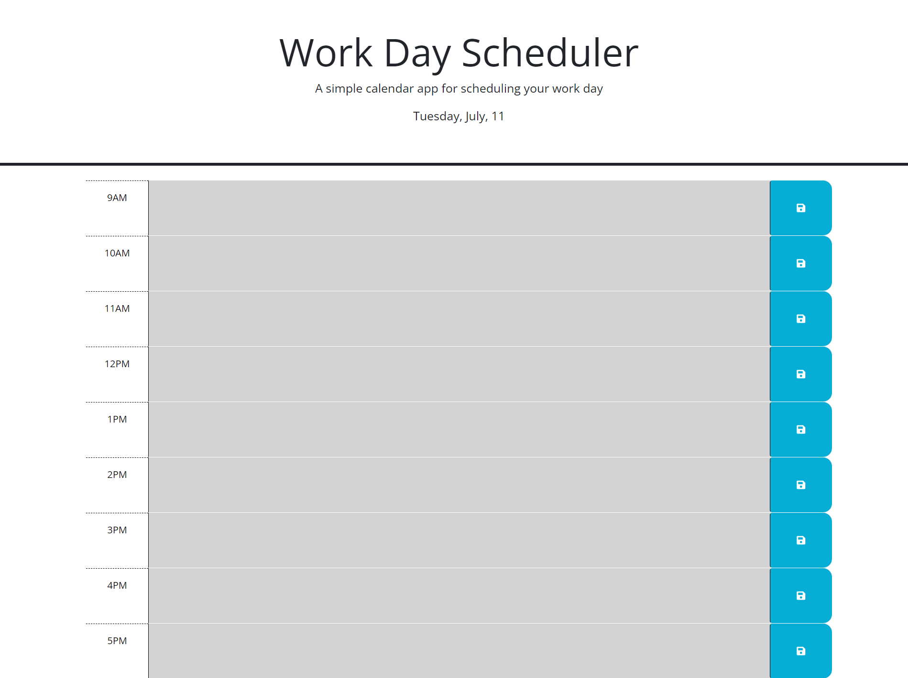

# Work Day Scheduler

This project was created to track and schedule your work day. It saves the data inputted into the text boxes as keys for future viewing. I learned more about how bootstrap, jQuery, and Dayjs worked in this project, and how they can interact with a webpage.

# Installation

N/A

# Usage

This project is to be used to keep track of your work day.

# Image of the live website

# Links

[My Github](https://github.com/cfinn7789/Work-Day-Scheduler)
[The website](https://cfinn7789.github.io/)